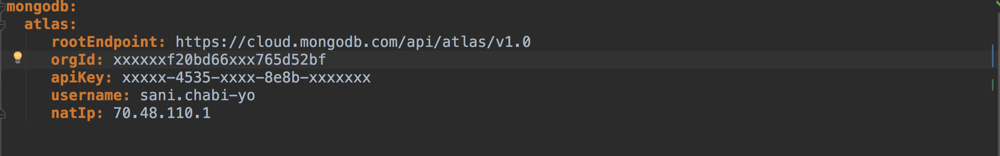

# A Cloud Foundry Service broker for MongoDB Atlas
Base application to demonstrate MongoDB Atlas Service Broker


## Introduction
This base application is intended to demonstrate a service broker implemenation for MongoDB Atlas. It allows to easily provision clusters in MongoDB Atlas from PCF marketplace. 


Please note that the service broker was builkt for demonstration purpose. Use in production at your own risk. Your feedback is however welcome to improve it! 


## Getting Started

**Prerequisites**
- Cloud Foundry CLI
- A PCF environment, you can also use PCF Dev
- Git Client
- Java SE Development Kit
- Maven

### Configuring the catalog ###

One of the main thing you migh want to configure here is the MongoDB Atlas tiers you want the service broker to expose. Two file need to be updated for that.


**1. Define MongoDB Atlas target**

Here weed to to tell the service broker how to communicate with MongoDB Atlas and how to automatically provision clusters. In the application.yml, confgure the following 3 properties to target your Atlas environment.



You can check Here on how to generate your Atlas API key.

This implementation of the service broker assume each requested cluster will live in its own project and all clusters will live inside one organization. In case you have a different structure in mind the source code can be changed accordingly.

**2. Define the service catalog**

Still within the application.yml, using the spring.openservicebroker.catalog property. In the example below, only one service with 4 differents plans will be advertised. In this context each plan will translate to a tier in MongoDB Atlas.

```
      catalog:
        services:
        - id: Atlas_AWS
          name: mongodb-atlas-aws
          description: MongoDB Atlas Service on AWS
          bindable: true
          tags:
          - MongoDB
          - Atlas
          - AWS
          plans:
          - id: aws-dev
            name: aws-dev
            bindable: true
            free: true
            description: Please use this for Dev (This is a multinenant environment)
          - id: aws-qa
            name: aws-qa
            bindable: true
            description: Please use this for Qa
          - id: aws-prod
            name: aws-prod
            bindable: true
            description: Please use this for any Production deploiement
          - id: aws-global_cluster
            name: aws-global_cluster
            bindable: true
            description: Please use this for any Production deploiement that requires global cluster. It includes 2 zones in US_EAST and US_CENTRAL
```

Here we are defining a service that will provision cluster on AWS using Atlas, and that service has 4 different plans for 4 differents type of usage:
- Dev  
- QA
- Production
- Production that require Global cluster


The beauty here, is that this is a very flexible configuration, as you can add new services, new plans as you wish here, it does not make any difference. For example you might want to include deployment in GCP or Azure, or create various T-shirt size for each of your environments.


**3. Provide provisioning details for each plan**

In this section, you will have to provide the REST API JSON message that will be used to provision the environment on Atlas. Each plan will be associated with a JSON file that is named after the plan ID, this is very important, that how the service broker knows with JSON message to send over. For every plan defined in section 2. abaove the corresponding json file need to exist. Check [HERE](https://docs.atlas.mongodb.com/reference/api/clusters-create-one/)  for all possible configuration parameters.


**Building**
```
$ git clone [REPO]
$ cd [REPO]
$ mvn clean install
``` 

### Installing on Cloud Foundry
The application is set to use an embedded H2 database and to take advantage of Pivotal CF's auto-configuration for services. To use a MySQL Dev service in PCF, simply create and bind a service to the app and restart the app. No additional configuration is necessary.

Before deploying thge application, take a look at the manifest file for the recommended setting. Adjust them as per your environment.

After connection to your PCF environment. I'm using [PCF Dev](https://pivotal.io/pcf-dev) as environment


**Deploy the service broker app**


```
$ cd [REPO]
$ cf push
```

**Create Service Broker using CF CLI**

Using the URL of the just deployed app, create the service broker.

```
$ cf create-service-broker atlas admin supersecret http://atlas-broker.local.pcfdev.io
```


**Enable Marketplace access to Atlas Broker**

```
$ cf enable-service-access mongodb-atlas-aws
```


**Validate that the service is shown in the Marketplace**

```
$ cf marketplace
```


**create a service instance**

```
$ cf create-service mongodb-atlas-aws aws-dev mongo-dev 
```


This is an asynchronous process, you can run the followin command to check the provisioning state:

```
$ cf service mongo-dev 
```


**bind to a service instance**